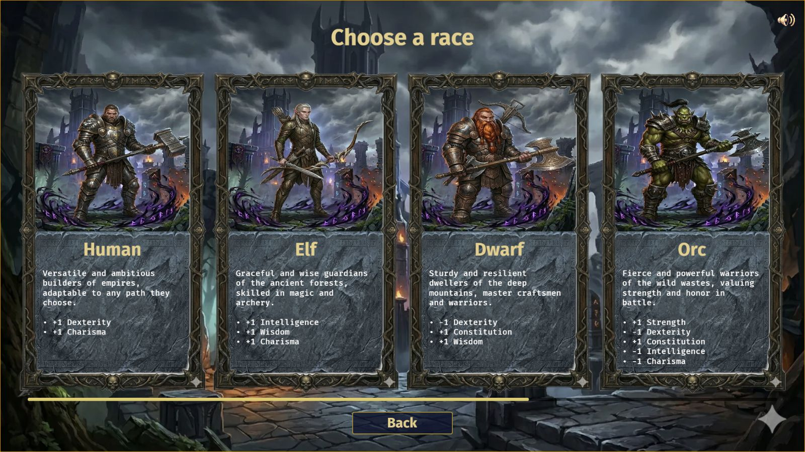
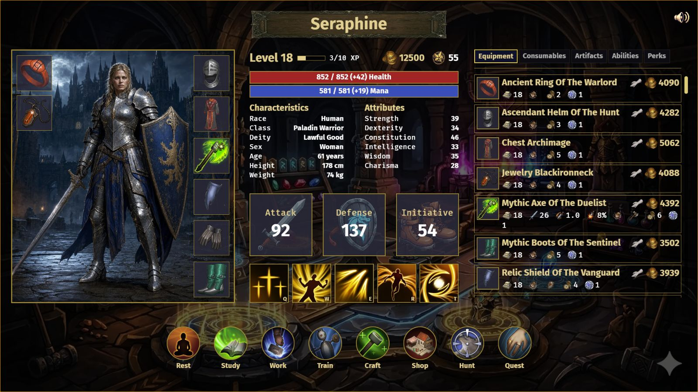
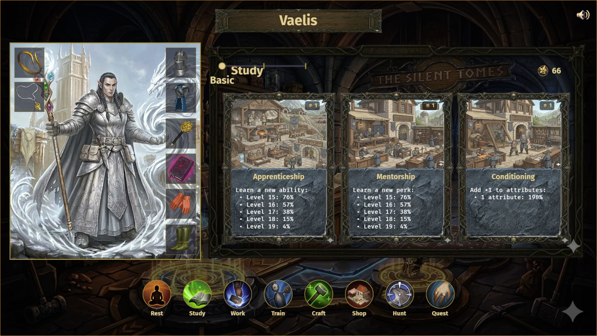
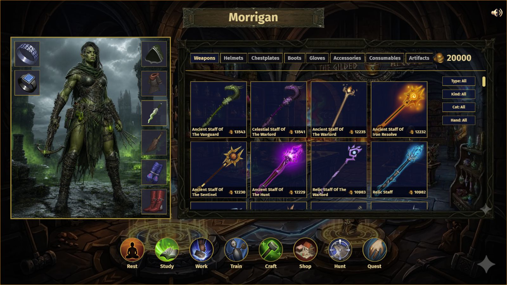
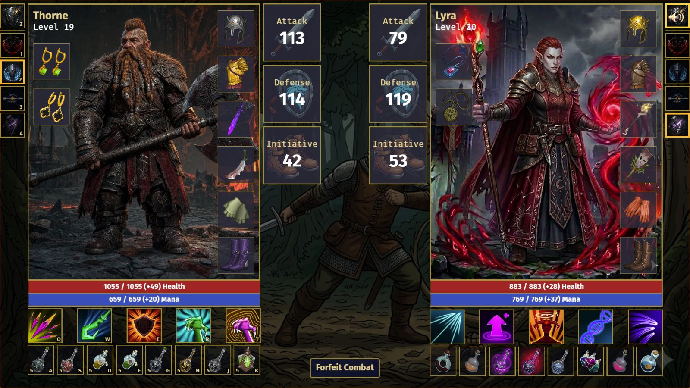
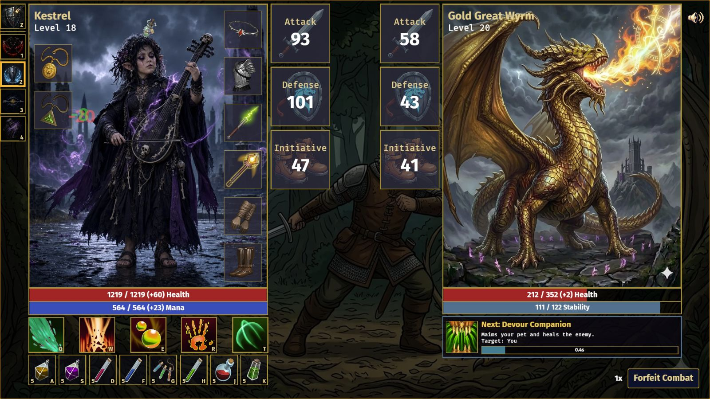

# Arcana
### A Rust-powered build-based RPG with tactical PvP combat

  

  

 

## 📜 Overview

Arcana is an intense, build-based RPG that pits players against one another in high-stakes,
tactical PvP combat. Set in a dark-fantasy world of arcane machinery and shifting realities,
players must master the balance between rigorous planning and real-time execution.

### Core Pillars
 
* Strategic Planning: Manage your Action Points (AP) to train stats, master professions,
  craft gear, and prepare your character for the duels ahead.
* Deep Build Customization: Choose from distinct races, classes, subclasses, pets and transformations.
* Tactical PvP Combat: Engage in fluid, peer-to-peer combat where timing your abilities and
  managing cooldowns can mean the difference between victory and defeat.
* Persistent Progression: Every victory earns stakes that impact your character's journey
  and remain saved to your persistent profile.

Step into the void, forge your legend, and claim your place in the Arcana.

 

## 🎮 How to Play

Arcana is built around a simple loop: improve your character outside combat, then cash
that build in during fights. You use actions like Rest, Study, Work, Train, Craft, Shop,
Hunt, and Quest to grow your character, collect gear, and prepare for Duels.

### Action Points (AP)

Action points (AP) are a permanent progress counter that goes up as you take actions, and
it never resets. Most actions cost AP. AP is a measure of your character's progress. Decide
with another player up to how much AP you want to play, and fight in a duel when ready.

| Action   |             AP  | What it does                                                                                                            |
|----------|----------------:|-------------------------------------------------------------------------------------------------------------------------|
| Rest     |       1 / 2 / 3 | Recover health and mana; better rest options heal more, and the best one can permanently raise max health and max mana. |
| Study    |       1 / 2 / 3 | Learn a new ability, learn a new perk, or gain attributes. Higher intensity leans toward higher-level rewards.          |
| Work     |       1 / 2 / 3 | Earn gold or artifacts. Harder jobs pay more, but some cost mana or health.                                             |
| Train    |               1 | Improve **attack**, **defense**, or **initiative** training for **melee**, **finesse**, or **ranged** weapons.          |
| Craft    | ceil(items / 2) | Turn artifacts into equipment, spending mana and some gold.                                                             |
| Shop     |               0 | Buy and sell gear, consumables, and artifacts.                                                                          |
| Hunt     |       1 / 2 / 3 | Gain XP, possibly trigger combat, and possibly find artifacts.                                                          |
| Quest    |       1 / 2 / 3 | Gain gold, equipment, consumables, and artifacts, with a chance to trigger combat.                                      |
| Duel     |               0 | Fight another player for gold or gear. Losing adds 5 AP and forces you to recover before continuing.                    |

### Player Attributes

All six core attributes start from a baseline of **10**. Your effective value is then
modified by things like race, age, sex, equipped gear, and perks.

| Attribute        | What it affects                                                                                                                                                                                   |
|------------------|---------------------------------------------------------------------------------------------------------------------------------------------------------------------------------------------------|
| **Strength**     | Flat **Attack** bonus. More Strength means harder basic hits.                                                                                                                                     |
| **Dexterity**    | Flat **Initiative** bonus. Higher Initiative improves turn timing and dodge chances in combat calculations.                                                                                       |
| **Constitution** | **Max Health**, **Health Regen**, and flat **Defense**. It also improves how much **Rough Rest** can recover and how much **Grand Accommodation** can permanently boost your max health and mana. |
| **Intelligence** | **Study** success chance and lower enemy dodge chance against your offensive abilities.                                                                                                           |
| **Wisdom**       | **Max Mana**, **Mana Regen**, and lower **Craft** gold costs.                                                                                                                                     |
| **Charisma**     | Better **Work** rewards, better **sell prices**, and a higher chance to come away from a **Hunt** with a pet offer.                                                                               |

### Items

| Item type       | What it does                                                                                                                                                              |
|-----------------|---------------------------------------------------------------------------------------------------------------------------------------------------------------------------|
| **Weapons**     | Determine your basic attack profile: **attack**, **attack speed**, **crit chance**, **kind**, and **category**. They can also grant passive modifiers and combat effects. |
| **Wearables**   | Helmets, chestplates, gloves, boots, and accessories. These mostly add passive modifiers, and some also trigger effects when you are hit.                                 |
| **Perks**       | Permanent passive bonuses. They do not need to be equipped.                                                                                                               |
| **Abilities**   | Active combat skills with a **mana cost** and **cooldown**. Some target you, some target the enemy.                                                                       |
| **Consumables** | Usable combat items such as potions. They apply self-buffs or recovery effects and are consumed on use. You can have up to **8 consumable types** equipped at once.       |
| **Artifacts**   | Crafting materials and valuables. You can find them through work, hunts, quests, and the shop, then **craft with them or sell them**.                                     |

 

## ⚔️ Combat Mechanics

Combat in Arcana is a real-time simulation driven by stats, timing, and active effects.
Each fighter attacks automatically at an interval determined by their attack speed, while
active abilities can be cast at the cost of mana and cooldowns.

### Ability and Weapon Kinds

Abilities and weapons both have a **kind**, which identifies their combat school or theme.

| Kind           | Meaning and progression                                                                                                       |
|----------------|-------------------------------------------------------------------------------------------------------------------------------|
| **Physical**   | The only non-magical kind. Warriors and Assassins are more likely to receive Physical abilities when gaining ability choices. |
| **Fire**       | A magical kind associated with Red Mages. Red Mages begin with and are more likely to receive Fire abilities.                 |
| **Ice**        | A magical kind associated with White Mages. White Mages begin with and are more likely to receive Ice abilities.              |
| **Nature**     | A magical kind associated with Green Mages. Green Mages begin with and are more likely to receive Nature abilities.           |
| **Holy**       | A magical kind commonly used for radiant, protective, and restorative abilities.                                              |
| **Shadow**     | A magical kind associated with Black Mages. Black Mages begin with and are more likely to receive Shadow abilities.           |

Druids and Mages are more likely to receive abilities of any magical kind. A Mage receives an
additional preference for the kind associated with their Ajah.

Kind is a classification, not an automatic status effect. A Fire weapon does not automatically
apply `Burn`, and an Ice ability does not automatically apply `Freeze`. Actual damage, healing,
buffs, debuffs, and status effects come from the ability or weapon's explicit **effects** list.
Likewise, kind alone does not change the basic damage formula.

#### Weapon Categories

Every weapon also has one category:

| Category    | Combat role                                                                                                                    |
|-------------|--------------------------------------------------------------------------------------------------------------------------------|
| **Melee**   | An attacking weapon using the Melee training profile.                                                                          |
| **Finesse** | An attacking weapon using the Finesse training profile.                                                                        |
| **Range**   | An attacking weapon using the Ranged training profile.                                                                         |
| **Magical** | An attacking magical implement. Mages and Druids can begin with this category.                                                 |
| **Shield**  | A support-hand item. It does not perform basic attacks; its effects trigger defensively when its wielder is hit.               |
| **Book**    | A support-hand magical item. Like a shield, it does not perform basic attacks and applies its effects when its wielder is hit. |

**Hand** is separate from both kind and category. One-handed attacking weapons can fill either
weapon hand, Shield and Book items use the support hand, and a two-handed weapon requires both
hands to be free.

### 1. Attack Interval and Timing

Every entity's attack timing is dictated by their **Attack Period**, which represents the
duration (in seconds) between basic auto-attacks:

$$\text{Attack Period} = \text{clamp}\left(\frac{2.0}{\text{Effective Attack Speed}}, 0.2, 10.0\right)$$

* **Effective Attack Speed** is modified by active effects:
  * `Freeze`: Multiplies speed by $1.0 + \text{attack speed pct} / 100.0$ (capped at $0.1$ minimum).
  * `BeastFrenzy`: Multiplies speed by $1.0 + \text{attack speed pct} / 100.0$.

---

### 2. Basic Attack Resolution Steps

When an attack triggers, it undergoes a sequential resolution process:

#### **Step A: Miss Chance**
An attack may miss entirely if the attacker is afflicted with **Blind**:
$$\text{Miss Chance} = \text{clamp}\left(\sum \frac{\text{Blind miss pct}}{100.0}, 0.0, 0.90\right)$$
If a random roll is below the miss chance, the attack fails.

#### **Step B: Dodge Chance**
If the attacker does not miss, and the defender is able to move (not `Immobilized`), the defender has a chance to dodge based on initiative differences:
$$\text{Dodge Chance} = \text{clamp}\left(0.18 + (\text{Defender Initiative} - \text{Attacker Initiative}) \times 0.018, 0.08, 0.70\right)$$

* **Effective Initiative** ($I$) is modified by:
  * `Haste`: Multiplies initiative by $1.0 + \text{initiative pct} / 100.0$.
  * `Paranoia`: Multiplies initiative by $(1.0 - \text{initiative pct} / 100.0)$ (capped at $0.0$ minimum).

#### **Step B2: Ability Dodge Chance**
Offensive abilities use the same base dodge roll, but the caster's Intelligence modifier reduces the defender's chance to evade:
$$\text{Ability Dodge Chance} = \text{clamp}\left(0.18 + (\text{Defender Initiative} - \text{Attacker Initiative}) \times 0.018 - \text{Caster Intelligence Mod} \times 0.018, 0.08, 0.70\right)$$

#### **Step C: Critical Strike Roll**
An attack has a chance to land a critical strike (inflicting double damage):
$$\text{Total Crit Chance} = \text{clamp}\left(\text{Base Crit} + \sum \frac{\text{Focus crit chance pct}}{100.0}, 0.0, 1.0\right)$$

---

### 3. Damage Calculation Formula

If the attack successfully hits, the raw damage is computed as follows:

$$\text{Base Damage} = \frac{\text{Effective Attack}^2}{\max(\text{Effective Attack} + \text{Effective Defense}, 1.0)}$$

$$\text{Final Damage} = \text{Base Damage} \times \text{Variance} \times \text{Incoming Multiplier} \times \text{Bleed Multiplier} \times \text{Crit Multiplier}$$

* **Variance**: A random multiplier between $0.85$ and $1.15$ rolled per hit.
* **Effective Attack**:
  * `Berserk`, `Empower`, and `BeastFrenzy` each apply $(1.0 + \text{percentage} / 100.0)$ multipliers.
* **Effective Defense**:
  * `Fortify` applies $(1.0 + \text{defense pct} / 100.0)$ multiplier.
* **Incoming Multiplier**:
  * `Vulnerability` multiplies incoming damage by $1.0 + \text{damage pct} / 100.0$.
* **Bleed Multiplier**:
  * If a one-shot `Bleed` effect is present on the attacker, it is consumed to multiply damage by $1.0 + \text{bleed damage pct} / 100.0$.
* **Critical Multiplier**:
  * Equals $2.0$ on a critical hit, and $1.0$ otherwise.
* **Minimum Damage**: Final damage is clamped to a minimum of $1.0$.

---

### 4. On-Hit and Reflection Effects

* **Lifesteal**: Heals the attacker by $\text{Final Damage} \times \sum (\text{Lifesteal pct} / 100.0)$.
* **Thorns**: Reflects damage back to the attacker, hitting them for $\text{Final Damage} \times \sum (\text{Thorns damage reflected pct} / 100.0)$.
* **Weapon Effects**: Applies active weapons' on-hit effect chains (e.g. Poison, Burn, Pierce) to the defender, and defensive weapon/shield on-being-hit effect chains back to the attacker.
